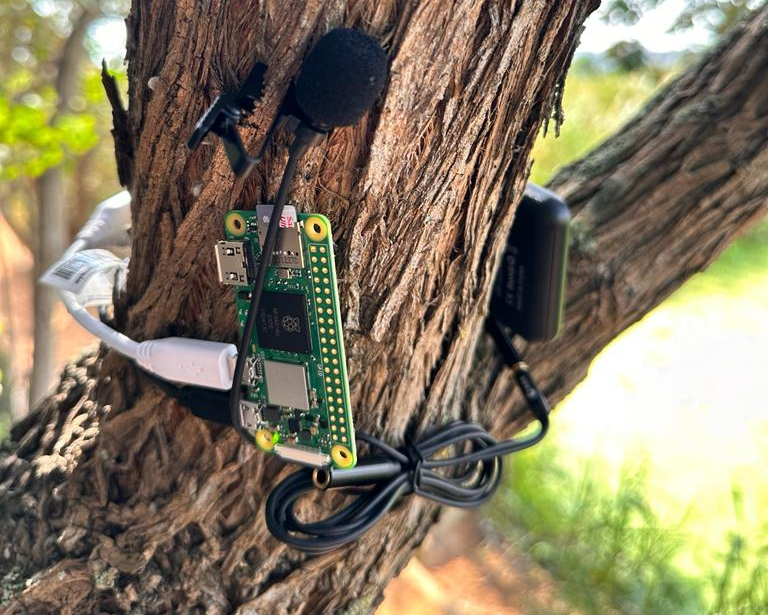

# Deep Learning in Bio-acoustic: case of Bird call detection

Here, we developed three Machine Learning Models to detect Bird calls in the audio sequences. The models explored are: Support Vector Machine (SVM), CNN binary classification from scratch and by transfer learning with the pre-trained ResNet50V2 model.

## Data collection
The data used in this work were recorded directly in the field at <a href="https://www.google.com/maps/place/Intaka+Island/@-33.888283,18.5040338,16z/data=!4m10!1m2!2m1!1sIntaka+Island!3m6!1s0x1dcc5c0500e09a03:0x6849fe1bc7618fc5!8m2!3d-33.888283!4d18.513561!15sCg1JbnRha2EgSXNsYW5kkgEQbmF0aW9uYWxfcmVzZXJ2ZeABAA!16s%2Fg%2F1hm292vgp?entry=ttu">Intaka Island</a> by a group of 26 students at AIMS South Africa evenly distributed over the collection area using Rasberry Pi. 

    

To keep the Raspberry Pi running smoothly, a background job has been set up so that as soon as the device is switched on, the sound recording task begins. Sequences of 30s of audio are then recorded.

The full dataset can be found <a href="https://doi.org/10.5281/zenodo.10675498"> here</a>

There is a demo  for the pre-processing and models training.

## Setting up
### 1. Load data file

To keep the code running, you need to have a data file `Data.zip` having the structure below:

    Data.zip/
        Annotations/
            1_someaudiofile_1.svl
            1_someaudiofile_2.svl
            2_someaudiofile_3.svl
            ...
            M_someaudiofile_N.svl

        Audio/
            1_someaudiofile_1.wav
            1_someaudiofile_2.wav
            2_someaudiofile_3.wav
            ...
            M_someaudiofile_N.wav

        DataFiles/
            TrainingFiles.txt
            TestingFiles.txt

        Model_Output/
            empty

        Pickled_Data/
            empty

        Saved_Data/
            empty

### 2. Create virtual environment in your workspace

    python -m venv env
    source env/bin/activate

### 3. Clone the github repository

    git clone https://github.com/beria-kalpelbe/Bird-Call-Detection.git
    cd Bird-Call-Detection

### 4. Install requirements

    pip install -r requirements.txt

### 5. Pre-process Training data

    python Pre-process-training-data.py

### 5. Pre-process Testing data

    python Pre-process-test-data.py

### 6. Train the CNN from scratch

    python CNN-training-evaluation.py

### 7. Train the model using transfer learning with ResNet50V2

    python transfer_learning_ResNet50.py

### 8. Train the model using SVM

    python SVM_training_test.py

### 9. Access to the results of the models

All the results are stored in the Plots folder. 
