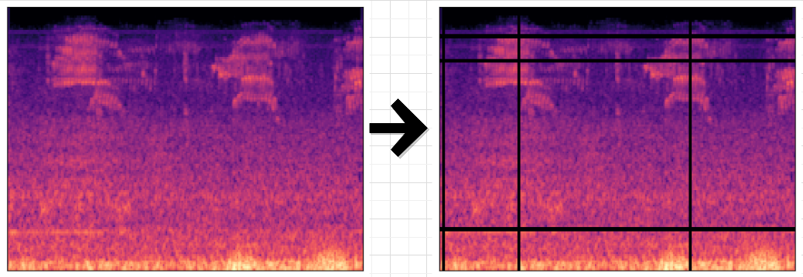

# Deep Learning in Bio-acoustic: case of Bird call detection
<a href="https://doi.org/10.5281/zenodo.10675498">
    </a>
<a href="https://colab.research.google.com/drive/1jQNUamyTX5-k_JV7f7WF34VAr16VnmGS?usp=sharing"> 
    
 </a>

Here, we developed three Machine Learning Models to detect Bird calls in the audio sequences. The models explored are: Support Vector Machine (SVM), CNN binary classification and the pre-trained ResNet50V2 model.


## Data collection
The data used in this work were recorded directly in the field at <a href="https://www.google.com/maps/place/Intaka+Island/@-33.888283,18.5040338,16z/data=!4m10!1m2!2m1!1sIntaka+Island!3m6!1s0x1dcc5c0500e09a03:0x6849fe1bc7618fc5!8m2!3d-33.888283!4d18.513561!15sCg1JbnRha2EgSXNsYW5kkgEQbmF0aW9uYWxfcmVzZXJ2ZeABAA!16s%2Fg%2F1hm292vgp?entry=ttu">Intaka Island</a> by a group of 26 students at AIMS South Africa evenly distributed over the collection area using Rasberry Pi. 


To keep the Raspberry Pi running smoothly, a background job has been set up so that as soon as the device is switched on, the sound recording task begins. Sequences of 30s of audio are then recorded.

<div style="text-align: center;">
    
</div>

## Methods
### 1. [Data Preprocessing](#data-preprocessing)

The sound data being raw, a pre-processing was carried out. Firstly, the audio data were manually annotated using Sonic Visualizer software. These annotated data were then cut into 4-seconds sound sequences, which we consider sufficient to contain the call of at least one bird. Finally, each audio sequence have been converted in spectrograms so as to have set of gray-scale images.

In Machine Learning, the problem of insufficient data is more and more recurring. The less data there is, the less diversified the data is, and so it doesn't sufficiently represent the population. One way of solving this problem is usually to artificially increase the data.

There is lot of technics to augment the data. But in this study, we use SpecAugment method. It consist to hide some parts of the spectrograms.



The most common pre-trained models take in input an image in RGB format. So, we have applied the luminosity method to convert the gray-scale images into RGB images. In concrete terms, for every pixel in a gray-scale format we have:

* $\text{Red value} = 0.3 \times (\text{Gray-scale value)})$
* $\text{Green value} = 0.59 \times (\text{Gray-scale value)})$
* $\text{Blue value} = 0.11 \times (\text{Gray-scale value)})$


### 2. [CNN model](#cnn-model-)
The architecture is relatively composed of 3 Convolutional layers, 1 flatten layer and 1 fully connected layer.


### 3. [ResNet50V2 model](#resnet50v2)
ResNet50 is a powerful image classification model and is used here as transfer learning base model to detect bird call vocalisations in the spectrograms.


### 4. [SVM model](#svm-model)
SVM learns to classify images by finding the hyperplane that best separates the feature vectors of different classes. The hyperplane is chosen to maximize the margin, which is the distance between the hyperplane and the nearest data point (support vector) from each class.


## Setting up
* Load data file
    ```
    wget https://zenodo.org/record/10675498/files/Data.zip
    unzip Data.zip
    ```
   

* Create virtual environment in your workspace
    ```
    python -m venv venv
    source venv/bin/activate
    ```

* Clone the github repository
    ```
    git clone https://github.com/beria-kalpelbe/Bird-Call-Detection.git
    cd Bird-Call-Detection
    ```

* Install requirements
    ```
    pip install -r requirements.txt
    ```

* Pre-process Training data
    ```
    python preprocess-train.py
    ```

* Pre-process Testing data
    ```
    python Ppreprocess-test.py
    ```

* Train the CNN from scratch
    ```
    python cnn.py
    ```

* Train the model using transfer learning with ResNet50V2
    ```
    python resnet50.py
    ```

* Train the model using SVM
    ```
    python svm.py
    ```

* Access to the results of the models
All the results are stored in the Plots folder. 
